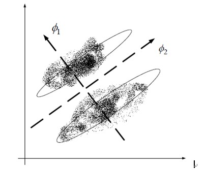
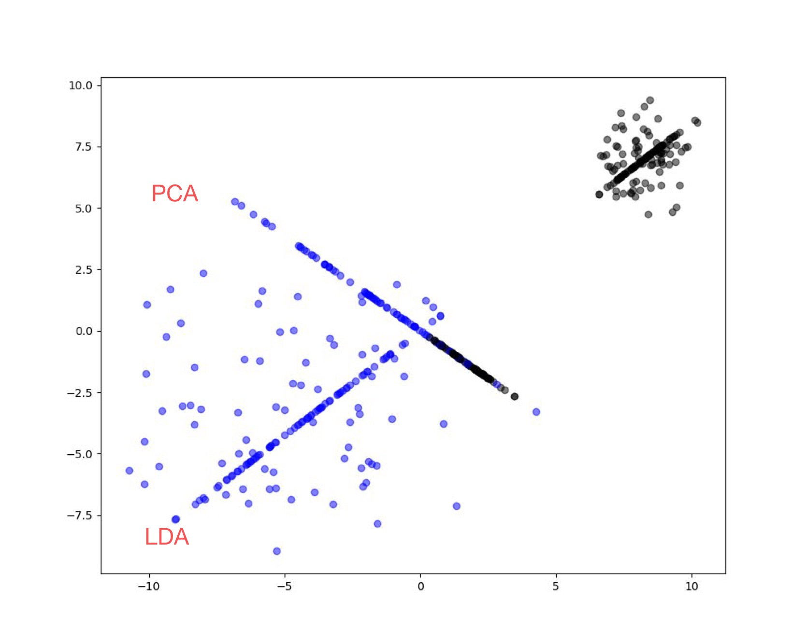
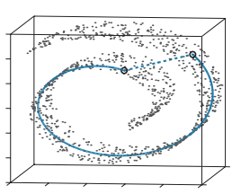
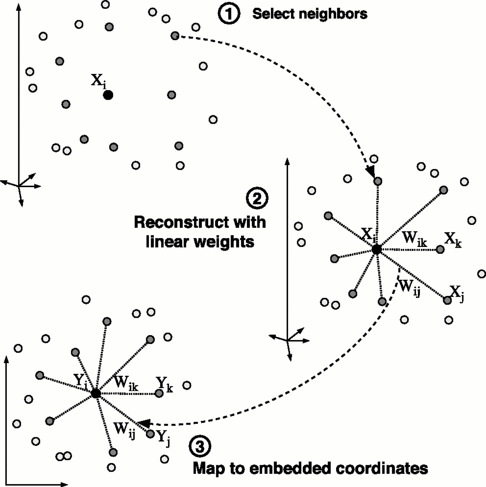
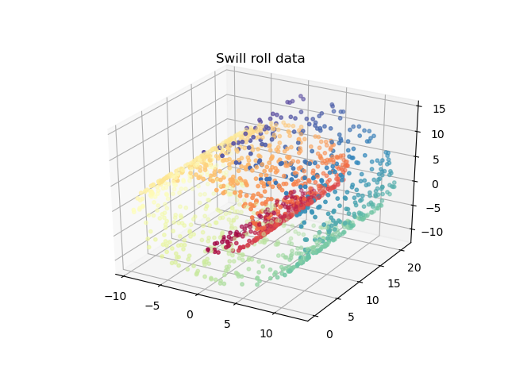
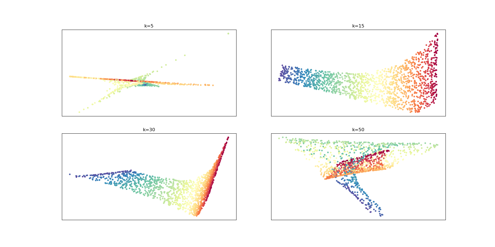

# 1.降维技术

## 1.1定义

​	我们现实世界中遇到的大部分数据往往都拥有比较高的维度，最典型就是图像数据，维度往往高达上万，由于计算机速度的限制，在研究和处理这一类高维数据时将会变得十分困难和麻烦，这也就是我们所说的“维数灾难”。而且我们进行处理时并不需要数据的全部维度信息，需要的只是其中某一个低维分布，这个低维分布可以看做是高维数据中的一个低维嵌入，最典型的就是瑞士卷数据，看上去是三维的，本质上是一个二维平面卷成三维。降维过程可以有如下定义：假设我们有$D$维数据：$X = [x_1\dots x_n]^T,X\in R^{n\times D},x_i\in R^D$，通过某种映射关系，将高维数据映射到$d$维数据：$Y = [y_1\dots y_n]^T,Y\in R^{n\times d},y_i\in R^d,d<<D$。

​	对于降维后的维度选定，一般来说是基于降维后的效果而定的，评价降维结果的好坏可以从两个方面入手，一个是通过降至二维和三维，然后将数据进行可视化分析；另一种则是通过比较降维后学习器的性能进行评价。前者是一种定性的评价标准，比较主观。后者则是可以进行定量描述，一般来说可以通过对降至不同维度的数据进行交叉验证来选择一个较好的维度值。

下面我们将分为线性降维技术和非线性降维技术，分别介绍几种典型的降维技术。

## 1.2线性降维

### 1.2.1主成分分析法（PCA）

​	主成分分析法（Principal Component Analysis，简称：PCA）是一种无监督的线性降维方法，最早是由（统计学之父：Karl Pearson，1901）首次提出。它通过线性投影的方式，将高维空间的数据投影到低维子空间表示，并期望投影后的数据方差尽可能大，这样才能最大程度保留原始数据的样本差异信息。如果投影到低维空间的数据全部映射到一起，那必然会丢失大部分信息，将无法区分不同样本的区别，这也是为什么要使得投影后的数据方差尽可能大的原因。这只是从最大可分性推导PCA算法，同样也可以从最近邻重构的角度出发得到相同的公式，下面将简要从最大可分性推导PCA算法。

​	假设投影前高维数据$X = [x_1\dots x_n]^T,X\in R^{n\times D},x_i\in R^D$

​	投影后的低维数据$Y = [y_1\dots y_n]^T,Y\in R^{n\times d},y_i\in R^d,d<<D$

​	假设数据都经过了去中心化，即$x_i\gets x_i-\frac{1}{n}\sum_ix_i$,目标是寻找一个变换矩阵，或者说是映射矩阵$W$使得$y_i=W^Tx_i$，使得投影后的样本点尽可能分开，即数据的方差尽可能大，同时为了统一新尺度范围：$W^TW = I$。

​	投影后样本点的方差为：$Var(Y)=\sum_i y_iy_i^T=\sum_iW^Tx_ix_i^TW$

​	所以我们优化的目标可以写成：
$$
\max\limits_{W}tr(W^TXX^TW)\\
st. W^TW = I
$$
​	使用拉格朗日乘子法，构造拉格朗日函数：
$$
L(W)=tr(W^TXX^TW) - \lambda(W^TW-I)
$$
​	对拉格朗日函数求导，令导数为0：
$$
\frac{\partial L}{\partial W} = XX^TW - \lambda W = 0\\
\frac{\partial L}{\partial \lambda} = W^TW-I = 0
$$
​	由此可得，目标函数最大值为：$tr(W^TXX^TW)=tr(\lambda W^TW)$

​	特征方程为：
$$
XX^TW=\lambda W
$$
​	只需要对协方差矩阵$XX^T$进行特征值分解，取前$d$个最大的特征值对应的特征向量组成的线性变换矩阵$W=（w_1,\dots,w_i）$,其中$w_i$为第$i$个特征值对应的特征向量。

​	PCA算法具体实现如下所示：

***

​		输入：样本集合$X=[x_1,\dots,x_n]^T$，降维后的维度为$d$

​		1.计算样本均值，并对样本进行去中心化$x_i = x_i-\frac{1}{n}\sum_ix_i$

​		2.计算样本的协方差矩阵：$S = XX^T=\sum_i x_ix_i^T$

​		3.对协方差矩阵进行特征值分解，取前$d$个最大特征值对应的特征向量组成变换矩阵$W=(w_1,\dots,w_d)$

​		4.对输入样本进行降维：$y_i=W^T(x_i-u)$

​		输出：线性变换矩阵$W$，降维后样本集合$Y$

***

​	

​	对于特征值个数，也就是主成分个数的选择来说，虽然我们可以尽量选择较多主成分个数可以最大程度保留原始数据的信息，但我们也不得不注意到，前几个最大主成分所代表的数据差异信息占全部样本差异信息的比例很高，对样本数据的影响更加关键。

​	PCA算法需要对协方差矩阵$XX^T$进行特征值分解，$XX^T$是$D$维矩阵，$D$是样本的维度，这对于维度很高的数据来说计算量将会十分巨大，最典型的就是图像数据。但通常情况下图像数据样本个数比其维度要更低，$X^TX$又是$n$矩阵，$n$样本个数，如果能够对$X^TX$进行特征值分解将会轻松很多。
$$
XX^TXV = \lambda XV \gets X^TXV = \lambda V\\
XX^TW=\lambda W 
$$
​	如上所示，先计算$X^TX$的特征向量$V$,再将特征向量转化为原来协方差矩阵$XX^T$的特征向量$W=XV$

​	PCA在人脸识别、硬币识别和降维等应用中十分广泛，尤其是基于PCA的eigenfaces技术，即先用PCA对图像进行降维，再利用kNN进行人脸识别的技术，堪称人脸识别里程碑式的工作。

​	如果样本数量同样过于庞大，选择 Simple PCA 以及 probabilistic PCA 这种迭代处理的方式也是一种不错的选择。

​	虽然PCA追求的是最大化投影后数据的方差，但是由于其不知道样本的类别标签，就会导致在投影时过度追求投影后数据的可分性，即最大化投影后数据的方差，忽视了数据之间的关联性，这就会使得PCA投影后的数据进行分类时的效果往往不尽入人意。如下图所示：

 图1.1 数据投影示意图

​	在上面这种情况下，PCA会盲目追求投影后的数据方差最大化，选择$\phi_2$轴进行投影，使得本来很好区分的两类样本杂糅在了一起，导致无法区分。

### 1.2.2 线性判别分析（LDA）

​	线性判别分析（Linear Discriminant Analysis，简称LDA）是一种有监督的线性降维方法，最早是由（Fisher,1936）提出，所以也称为Fisher判别分析。它最大的特点是既是一种降维方法，同时又是一种分类方法，与上面提到的PCA一样，通过投影的方式进行降维，LDA也追求降维后的数据的方差最大，但与之不同的是，LDA处理时拥有了样本数据的类别标签属性，而这多出来的数据也促使LDA能够克服PCA盲目追求方差最大化的缺点，使得投影后的数据可分性进一步提高。

​	LDA的主要思想也很简单：既然我已经知道了样本类别标签，那么投影后的低维数据的方差最大化将不再针对于全部样本，而是针对于不同类别的样本簇，即使得不同类之间的样本点尽量离得足够远；同时为了使得同类数据尽可能集中，就也要使得相同类别的样本尽可能接近。总结起来，LDA的终极目标就是使得投影后的数据类内散度尽可能小，类间散度尽可能大。下面是公式推导：

​	假设投影前高维数据$X = [x_1\dots x_n]^T,X\in R^{n\times D},x_i\in R^D$

​	投影后的低维数据$Y = [y_1\dots y_n]^T,Y\in R^{n\times d},y_i\in R^d,d<<D$

​	假设有$C$类样本，第$i$类样本个数是$N_i$，$m_i$是第$i$类样本的均值，$x_i^j$表示第$i$类中第$j$个样本，$m$是所有样本的均值。

​	类内散度定义：
$$
S_w=\sum_{i=1}^{C}\sum_{j=1}^{N_i}(x^j_i-m_i)(x^j_i-m_i)^T
$$
​	类间散度定义：
$$
S_b = \sum_{i=1}^{C}N_i(m_i-m)(m_i-m)^T
$$
​	为了使类内散度更小，类间散度更大，我们的优化目标可以写成如下形式：
$$
\max\limits_{w}J(w)=\frac{w^TS_bw}{w^TS_ww}
$$
​	为了找到极值，上述式子对$W$进行求导，并令导数为0，可得：
$$
\frac{\partial J(w)}{\partial w}=\frac{(2S_bw)(w^TS_ww)-(w^TS_bw)(2S_ww)}{(w^TS_ww)^2}=0\\
\begin{aligned}
S_bw(w^TS_ww)&=S_ww(w^TS_bw)\\
S_bw&=S_ww\frac{(w^TS_bw)}{w^TS_ww}
\end{aligned}
$$
​	令$\lambda=\frac{(w^TS_bw)}{w^TS_ww}$,$\lambda$是一个常量。整理可得：
$$
S_w^{-1}S_bw=\lambda w
$$
​	最终LDA问题变成了对$S_w^{-1}S_b$进行特征值分解，寻找其前$d$个最大特征值对应的特征向量，组成一个变换矩阵$W$对样本数据进行投影，$y_i=W^Tx_i$。

​	LDA算法具体实现如下图所示：

***

​	输入：带标签样本集合$X=[x_1,\dots,x_n]^T$，降维后的维度为$d$

1. 计算样本的类间散度矩阵$S_b$
2. 计算样本的类内散度矩阵$S_w$
3. 对$S_w^{-1}S_b$矩阵进行特征值分解，取前$d$个最大特征值对应的特征向量组成变换矩阵$W=(w_1,\dots,w_d)$
4. 对输入样本进行降维：$y_i=W^Tx_i$

​	输出：线性变换矩阵$W$，降维后样本集合$Y$

***

 图1.2 LDA与PCA对两类数据进行投影

​	从上述图片中可以看出，LDA在保证了投影后数据的方差尽可能大的情况下，由于知道了类别标签信息，可以使得不同类别的数据有着更好的可分性，如果是PCA的话就很有可能为了使得投影后数据方差足够大，导致不同类别的数据杂糅在一起，影响后期分类器的性能。

## 1.3非线性降维

### 1.3.1核主成分分析（KPCA）

​	线性降维方法都是假设数据从高维空间映射到低维空间是线性的，这种假设在一般情况下是成立的，但在有些特别数据情况下却并成立，因为这些数据往往需要通过非线性映射才能找到恰当的低维情形。核主成分分析就是基于核方法对线性降维的主成分分析技术的一种改进,同样基于核方法的支持向量机技术也十分的成功。

​	核主成分分析的基本思想：运用核函数对样本进行非线性变换，在变换空间进行主成分分析。等价于在原始空间进行非线性主成分分析。

​	技术路线：

​	高维数据$X = [x_1\dots x_n]^T,X\in R^{n\times D},x_i\in R^D$

​	降维后低维数据$Y = [y_1\dots y_n]^T,Y\in R^{n\times d},y_i\in R^d,d<<D$

 1. 选择一种核函数$k(x_i,x_j)$，对原始样本数据做非线性变换$\phi(x)$，求出样本的核矩阵$K=\phi(x)\phi^T(x)$，$K_{ij}=k(x_i,x_j)$。

 2. 对核矩阵进行特征值分解，取前$d$个最大特征值对特征向量组成$V=(v1,\dots,v_d)$，再转化为非线性空间中协方差矩阵的特征向量。
    $$
    w_j=\sum_{i=1}^nv_i^j\phi(x_i)
    $$

 3. 对于新样本$x_i$，其投影后的第$j$维坐标为：
    $$
    y_i^j=w_j^T\phi(x)=\sum_{i=1}^nv_i^j\phi(x_i)\phi(x)=\sum_{i=1}^nv_i^jk(x_i,x_j)
    $$

​	核主成分分析最大的缺点就是核矩阵的大小正比于数据集样本个数，对于大样本的数据而言，对计算机的计算压力很大。

### 1.3.2等度量映射（Isomap)

​	等度量映射（Isometric Mapping，简称：Isomap）是非线性降维方法，也是流形学习的一种,流形学习是一类借鉴了拓扑流形概念的降维方法，“流形”是在局部与欧式空间相同的空间，也就是说，它在局部具有欧式空间性质和计算方法。后面我们要讲到的局部线性嵌入（LLE）降维方法与Isomap一样同属于流形学习的方法。Isomap方法则是在MDS方法之上引入“测地距离”而产生的，MDS方法的基本思想是高维空间的样本之间的距离与低维空间中样本距离是保持相同的。Isomap就是在这个“距离“概念上做文章的。MDS方法采用的是经典坐标距离，即两个样本点之间的欧氏距离，这种距离在三维空间中就如下图中的蓝色虚线所示，我们可以明显看到，在对于瑞士卷图形中，两点之间的距离用欧式距离表示是十分不恰当的，因为从一点到另一点要从曲面上行进，不能隔空穿越。

 图1.3 测地距离示意图

​	Isomap方法引入的“测地距离”就是指两个样本点之间的最短距离，也就是上图中的蓝色实线，这样更符合高维流形中实际的空间状况。但实际中要想把“测地距离”算出来也不是一件轻松的事情，但我们可以利用流形假设的概念，认为该高维数据在局部空间具有欧式空间的性质，这样就把计算相邻点“测地距离”的任务转变为计算相邻点欧式距离的任务了。然后再通过其他路径规划算法，比如Dijkstra算法，把任意两点的距离通过前面所计算得到相邻点连接起来得到。

​	Isomap算法具体实现方法：

***

​	输入：带标签样本集合$X=[x_1,\dots,x_n]^T$，降维后的维度为$d$，相邻点参数$k$

1. 确定每一个样本点$x_i$的$k$个近邻，并求出$x_i$与$k$个近邻之间的欧式距离，与其他点距离设为无穷大。
2. 调用最短路径算法计算任意两样本点之间的最短距离$dist(x_i,x_j)$。
3. 将最短距离$dist(x_i,x_j)$作为MDS算法的输入
4. 返回MDS算法的输出

​	输出：降维后样本集合$Y$

***

### 1.3.3局部线性嵌入LLE

#### LLE原理

​	终于轮到主角登场，局部线性嵌入（Locally Linear Embedding，简称：LLE）是一种无监督的非线性降维技术,同时也是流形学习方法的一种，不同于PCA和LAD这些线性降维技术只能针对于线性数据处理，在处理非闭合的流形数据时有很好的效果。LLE十分类似于Isomap，通过”局部“二字就可以知道，LLE并不像Isomap那样寻求保持每个样本点与其他所有样本点之间的距离关系，而是希望通过保持每个样本点与周围领域内样本点的距离关系来进行降维，这有点类似绝对位置与相对位置的关系，“线性”则是对于每个样本点，可以用周围样本点的线性组合进行表示，这同样是基于流形数据的重要假设，即局部空间具有欧式空间的性质，可以将其近似于平面来处理。“嵌入”则指的是通过高维数据中求得的样本点与周围样本点的关系在低维空间进行重建，类似于把高维空间的数据分割成一个一个小的碎片，然后再在低维空间把这些碎片拼起来。

​	LLE算法具体思想：

​	高维数据$X = [x_1\dots x_n]^T,X\in R^{n\times D},x_i\in R^D$

​	降维后低维数据$Y = [y_1\dots y_n]^T,Y\in R^{n\times d},y_i\in R^d,d<<D$

1. 寻找每个样本$x_i$的领域范围内样本点，采用$k$近邻方法，寻找距离$x_i$最近的$k$个样本点$x_{ij}$，距离一般采用欧式距离。
2. 既然我们认为局部范围可当做平面处理，那么我们可以用这$k$个样本点$x_{ij}$线性表示$x_i$

$$
x_i = \sum_{j=1}^kw_{ij}x_{ij}
$$

​	显然，我们的目标是使得线性组合$ \sum_{j=1}^kw_{ij}x_{ij}$与实际样本之间的差距尽可能小，才能认为可以用这$k$个样本点	$x_{ij}$线性表示$x_i$，这就引入了我们的目标损失函数：
$$
\min\limits_{W}\epsilon(W)=\sum_i|x_i-\sum_{j=1}^kw_{ij}x_{ij}|
$$
​	通过使得目标函数最小化，可以求得权重系数$W=(w_1,\dots,w_n),w_i=(w_{i1},\dots,w_{ik})$

3. 最后一步涉及到LLE的重要思想，认为我们从高维数据映射到低维数据时对每一个区域数据重建，对于权重来说具有不变性，即降维后的低维数据领域内的距离权重系数与高维数据是相同的,依旧可以表示为$k$近邻个样本点的线性组合。故我们的目标损失函数为：
   $$
   \min\limits_{Y}\Phi(Y)=\sum_{i}|y_i-\sum_{j=1}^kw_{ij}y_{ij}|
   $$
   求解目标函数可以得到降维后的数据：$Y=(y_i\dots y_n)$

   

   
 图1.4 LLE降维示意图

#### LLE推导过程

 1. 首先我们需要统一数据形式，下面做出一些规定。

    高维数据$X = [x_1\dots x_n],X\in R^{D\times n}$

    降维后低维数据$Y = [y_1\dots y_n],Y\in R^{d\times n}$

    权重系数：$w=(w_1\dots w_n),w\in R^{k\times n}$

    近邻点个数：$k$

 2. 寻找每个样本点$x_i$的领域内的样本点。

    LLE采用的是$k$邻法，即寻找样本点$x_i$的$k$个距离最近的样本点。其实也有其他方法，即通过距离阈值法，若距离阈值小于我们规定的值就被选为近邻点，但这种方式容易造成数据间的不平衡，即有些样本点会获得更多的样本点进行表示，而有些就很少。近邻点的个数是LLE唯一可变的参数，也是影响降维后效果的重要参数。
    $$
    N_i=knn(x_i,k)=(x_{i1}\dots x_{ik})
    $$
    其中$x_{ij}$表示为$x_i$样本点的第$j$个近邻样本点

    3. 求解重建权重系数

    求解的目标损失函数如下：
    $$
    \min\limits_{w}\epsilon(w)=\sum_{i=1}^n|x_i-\sum_{j=1}^kw_{ij}x_{ij}|\\
    st.\sum_{j=1}^kw_{ij}=1
    $$
    $st.\sum_{j=1}^kw_{ij}=1$是为了限制权重大小，进行归一化。$w_{ij}$表示$x_i$样本点与第$j$个近邻样本点的权重系数。

    现在需要对$\epsilon(w)$进行一些必要的化简：
    $$
    \begin{aligned}
    \epsilon(w)&=\sum_{i=1}^n|x_i-\sum_{j=1}^kw_{ij}x_{ij}|^2\\
    &=\sum_{i=1}^n|\sum_{j=1}^k(x_i-x_{ij})w_{ij}|^2,\quad x_i\sum_{j=1}^kw_{ij}=x_i\\
    &=\sum_{i=1}^n|(X_i-N_i)w_i|^2,\quad X_i=(x_i\dots x_i)\in R^{D\times k},N_i=(x_{i1}\dots x_{ik})\in R^{D\times k}\\
    &=\sum_{i=1}^nw_i^T(X_i-N_i)^T(X_i-N_i)w_i
    \end{aligned}
    $$
    上式中$X_i=(x_i\dots x_i)$是将$x_i$扩充成$k$个。令$S_i=T(X_i-N_i)^T(X_i-N_i)$为局部协方差可得
    $$
    \epsilon(w)=\sum_{i=1}^nw_i^TS_iw_i
    $$
    然后运用拉格朗日乘子法：
    $$
    L(w_i)=\sum_{i=1}^nw_i^TS_iw_i+\lambda(w_i^TI_k-1)\\
    w_i =(w_{i1}\dots w_{ik})^T
    $$
    $I_k$为$k\times1$的列向量，对上述式子求导，令导数为0：
    $$
    \frac{\partial L(w_i)}{\partial w_i}=2S_iw_i+\lambda I_k = 0\\
    w_i=-\frac{\lambda}{2}S_i^{-1}I_k
    $$
    $-\frac{\lambda}{2}$为一个常数，可以忽略这个常数，我们最重要的是将$w_i$进行归一化，$I_k^TS_iI_k$为$w_i=S_i^{-1}I_k$列向量每个元素之和，故归一化后的权重系数$w_i$为：
    $$
    w_i=\frac{S_i^{-1}I_k}{I_k^TS_iI_k}
    $$
    $S_i$为$k\times k$局部协方差矩阵。

    4. 映射到低维空间

    求得高维数据的权重系数后，低维数据中的权重系数也将与高维数据保持一致，即求解以下目标损失函数：
    $$
    \min\limits_{Y}\Phi(Y)=\sum_{i}|y_i-\sum_{j=1}^kw_{ij}y_{ij}|^2\\
    s.t. \quad \sum_{i=1}^ny_i=0,\quad\sum_{i=1}^ny_iy_i^T=nI_{d\times d}
    $$
    $\sum_{i=1}^ny_i=0,\quad\sum_{i=1}^ny_iy_i^T=nI_{d\times d}$是为了得到中心化和标准化的低维数据，加入的约束条件。

    降维后低维数据$Y = [y_1\dots y_n],Y\in R^{d\times n}$

    现在需要将目标函数矩阵化，首先，需要用一个$n\times n$的稀疏矩阵$W$来表示$w$：

    对第$i$个样本点的$j$个近邻点：$W_{ij}=w_{ij}$，否则：$W_{ij}=0$。

    由此可得：
    $$
    \sum_{j=1}^kw_{ij}y_{ij}=\sum_{j=1}^nw_{ij}y_{ij}=YW_i
    $$
    上式中：$w_{k+1},i\dots w_{n,i}=0$，$W_i$为$W$的第$i$列

    现在定义$I_i$是单位矩阵$I(n\times n)$的第$i$列，则目标函数变成以下形式：
    $$
    \Phi(Y)=\sum_{i=1}^n|Y(I_i-W_i)|^2
    $$
    由矩阵的迹的相关知识可知：$B=(b_1\dots b_n)$
    $$
    \sum_i(b_i)^2=\sum_ib^Tb_i=tr(BB^T)
    $$
    因此我们可以将$Y(I_i-W_i)$等效于$b_i$，$Y(I-W)$等效于$B$，由此可得：
    $$
    \Phi(Y)=tr(Y(I-W)(I-W)^TY^T)=tr(YMT^T)\\
    M = (I-W)(I-W)^T
    $$
    由拉格朗日乘子法可得：
    $$
    L(Y)=tr(YMY^T)+\lambda(YY^T-nI)
    $$
    求导，并令导数为0：
    $$
    \frac{\partial L(Y)}{\partial Y}=YM^T+YM+2\lambda Y=0\\
    YM=-\lambda Y
    $$
    由$M=M^T$可得：
    $$
    YM=-\lambda Y
    $$
    两边同时转置，并令$\lambda=-\lambda$：
    $$
    MY^T=\lambda Y^T
    $$
    由上述式子可以发现，要想求得低维数据$Y$，需要对矩阵$M$进行特征值分解，降维后的数据维度为$d$，要使得损失函数值最小，则需要取前$d$个最小特征值对应的特征向量，但一般第一个特征值都接近于0，故一般取[2,d+1]个特征值对应的特征向量作为输出结果。

    LLE算法具体实现：

    ***

    输入：样本集$X = [x_1\dots x_n],X\in R^{D\times n}$，降维后维数：$d$，近邻数：$k$

    1.确定样本点$x_i$的$k$个近邻点

    2.求得每个样本点$x_i$权重参数系数$w_{ij}$，得到权重矩阵$W$

    3.通过权重矩阵$W$得到矩阵$M$，对$M$进行特征值分解并取前[2,d+1]个特征值对应的特征向量$y_i$

    输出：降维后的数据集$Y=(y_1\dots y_d)$。

    ***

## 3.3近邻参数k的选择

​	由于LLE算法的自由参数近邻个数$k$对降维结果影响很大，故生成具有1500个样本点的三维瑞士卷数据，用不同的$k$值对瑞士卷数据进行降维至二维平面，降维结果如下所示。

 图1.5 瑞士卷数据

 图1.6 不同k值得降维数据

​	从图3.2可以看出，$k$值较小时把瑞士卷数据降低到低维空间的效果太差，因为近邻个数太少时，不能很好保持样本数据之间的结构特征。当$k=15$适中时，样本点降维后不同位置的数据点很好地区分开来，降维效果较好。而当$k$值较大时，由于近邻个数太多，导致计算样本点的重建权重系数将会十分接近，这就会使得样本点投影到低维空间时会互相重叠起来，丧失了原始数据的信息。